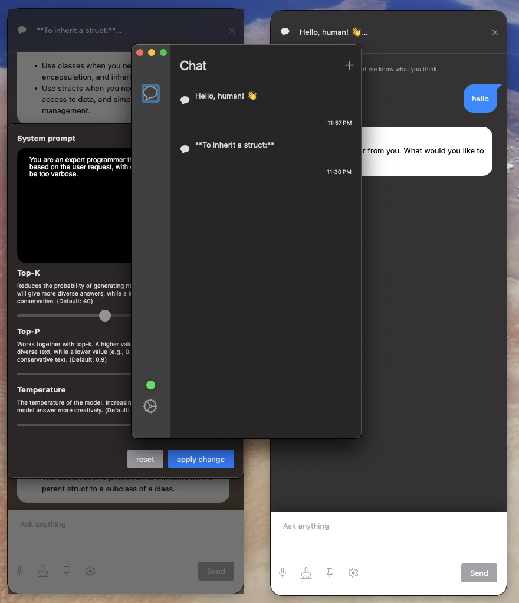
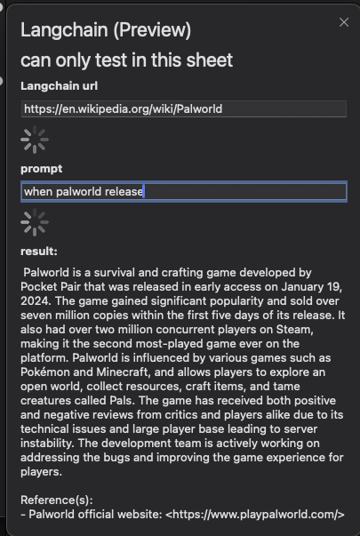

# OllamaGUI by SwiftUI


<p style="display:flex;justify-content:center;align-items:center"> 

</p>


https://github.com/enoch1118/ollamaGUI/assets/54224095/d056434a-f27e-41a9-940b-be7053f6920c

### Now can test langchain in ollama GUI
<p style="display:flex;justify-content:center;align-items:center"> 

</p>

This feature is completely native and does not require an API key.
It's a bit slow so far, but it does provide per-website storage, so once created, website embeds can be reused.
Since it's still in preview, you can't use it except for the window of the feature.


### Introduction to Ollamagui
ollama is a lightweight, extensible framework that lets you run powerful LLMs like Llama 2, Code Llama, and others on your own computer. This means you don't need to rely on cloud-based services or have specific hardware requirements.

OllamaGUI: A user interface (GUI) application built for macOS using SwiftUI framework, help you to use ollama model easily

### Installation

##### Requirements
* need llama2 model https://ai.meta.com/llama/
* ensure ollama server is running https://ollama.ai/

##### Clone the GitHub repository:
> ```bash
>git clone https://github.com/enoch1118/ollamaGUI.git
>```

##### Open the project in Xcode:
Open Xcode.
Go to "File" -> "Open".
Locate the ollamagui.xcworkspace file within the cloned repository and open it.

##### Install dependencies:

If you haven't already, install CocoaPods Open your terminal and run
 ```
 sudo gem install cocoapods.
 ```
In the terminal, navigate to the root of the OllamaGui project directory 
```
pod install 
```
to install required dependencies.


### Dependencies

1. swift-markdown-ui
https://github.com/gonzalezreal/swift-markdown-ui
2. SwiftUIIntrospect
https://github.com/siteline/swiftui-introspect
3. Alamofire
https://github.com/Alamofire/Alamofire


--- langchain

4. USearch
https://github.com/unum-cloud/usearch